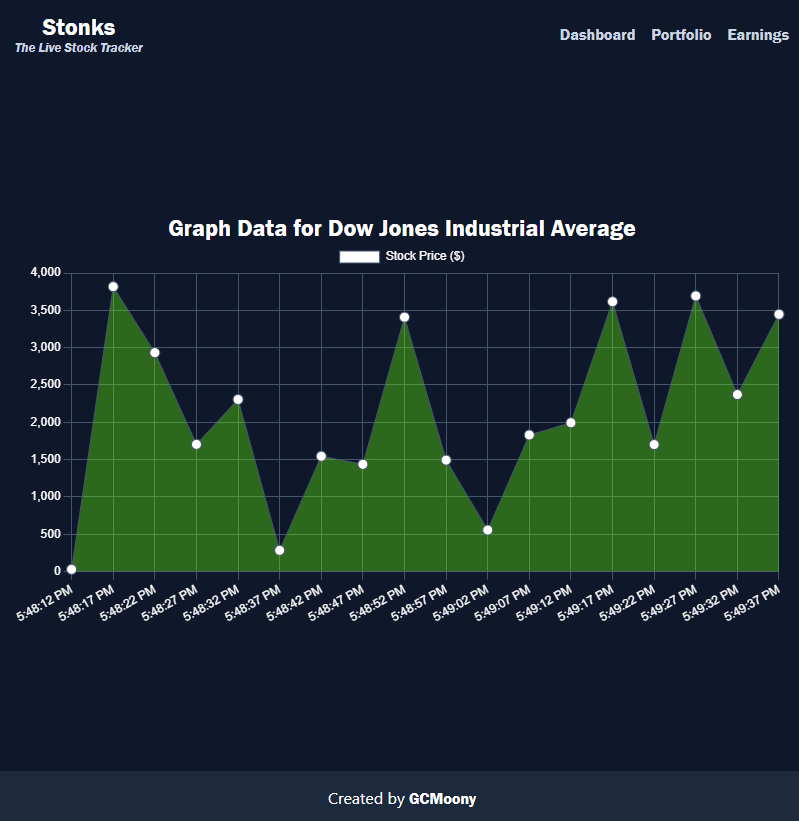

# Stonks

The Live Stock Tracker

## What does it do?

This is an example task to create a virtual dashboard for getting the current
stock price data of Dow Jones Industrial Average
([^DJI](https://finance.yahoo.com/quote/%5EDJI/)). The backend queries Yahoo
Finance every five seconds, and the updates are sent to the client via socket
connection using [Socket.IO](https://socket.io/).

This project uses [Chart.js](https://www.chartjs.org/) in the frontend to
display price history of the stock in real time. Nothing much to see when the
market is closed, however.

What I'd like to do in the future:

- Ability to select the stock to be viewed
- Ability to track different stocks
- Ability to view history in different lengths of time (1 day, 5 day, 1 week,
  etc.)
- Using the history that already exists when querying the API

### Demo

Here's a image demonstration of the application in use (with randomized values
due to market closure):   
